# Состояния и переходы алгоритма автополива (event-driven FSM, многоканально)

> Диаграмма отражает **текущую** логику `watering.be` (итерация 2 — многоканальность).
> Архитектура: `Watering` = диспетчер + общие ресурсы (SoilSensors A1..A4, общие
> FlowSensors C1/C2, общий PersistStore), `Plant` = канал (свой насос `Power{Num}`,
> свой SoilSensor, своя FSM, свои persist-ключи `P{Num}_*`). `MAX_CHANNELS = 4`.
> При изменении FSM-логики — обновлять эту схему, чтобы она не рассинхронизировалась с кодом.

```mermaid
flowchart TD
    %% ===================== ВХОДНЫЕ СОБЫТИЯ =====================
    EV_CRON{{"Событие: cron auto_flood (каждый час, окно 14:00–01:00)"}}
    EV_PW_ON{{"Событие: POWER{Num} вкл (relay ON)"}}
    EV_PW_OFF{{"Событие: POWER{Num} выкл (relay OFF)"}}
    EV_BTN{{"Событие: BUTTON1 SINGLE/DOUBLE → канал 1"}}
    EV_FINISH{{"Событие: FinishRule COUNTER#C1>=порог (общий счётчик)"}}
    EV_T_PLANT{{"Событие: cooldown-таймер канала ID_SOILTRANSITION_AFTERFLOOD_P{Num}"}}

    %% ===================== auto_flood — SWEEP =====================
    subgraph AUTO_FLOOD["auto_flood() — sweep-планировщик (round-robin)"]
        EV_CRON --> AF_FLOOD{"_flooding_plant() != nil (чужое реле ON)?"}
        AF_FLOOD -- да --> AF_SKIP[("sweep пропущен — одна заливка за раз")]
        AF_FLOOD -- нет --> AF_LOOP["цикл по каналам с _rr_idx (круг): idx = (_rr_idx + i) % N"]
        AF_LOOP --> AF_DUE{"p.due() = SoilSensor.IsDry() && !AutofloodInProcess?"}
        AF_DUE -- нет --> AF_NEXT["следующий канал"]
        AF_DUE -- да --> AF_RR["_rr_idx = (idx+1) % N"]
        AF_RR --> AF_SESS["p.start_session() — старт ровно ОДНОГО due-канала"]
    end

    %% ===================== start_session / start_flood =====================
    subgraph SESSION["Plant.start_session() — новая сессия (свеп)"]
        AF_SESS --> SS_PICK["0) _pick_preset(): RawEma > DryThreshold → пресет dry | иначе → normal"]
        SS_PICK --> SS_SAVE{"1) _stats_enabled() (пресет normal)?"}
        SS_SAVE -- да --> SS_BATCH["Prev*-статистика + estimate-входы партией Store.save_batch_entries(self._stats_batch()) — один save"]
        SS_SAVE -- нет (dry) --> SS_INIT
        SS_BATCH --> SS_INIT["2) init сессии: LastFloodVol=0, AutofloodInProcess=true, SoilHPreFlood=RawEma, сброс Max/Time/Temp"]
        SS_INIT --> SS_START["3) start_flood()"]
    end

    subgraph START_FLOOD["Plant.start_flood() — единая точка запуска (сессия / повтор / кнопка)"]
        SF_ENTRY --> SF_PICK{"Preset == nil?"}
        SF_PICK -- да --> SF_PK2["_pick_preset() — выбрать стратегию (без init-сессии)"]
        SF_PICK -- нет --> SF_DRY{"RawEma > RawWet — почва сухая по EMA?"}
        SF_PK2 --> SF_DRY
        SF_DRY -- нет --> SF_SKIP[("лог «soil not dry, skip» — помпа НЕ включается")]
        SF_DRY -- да --> SF_PLAN["PlannedFlood = Preset.dose() (normal → planned_dose(); dry → DrySoakDose)"]
        SF_PLAN --> SF_PWR["Power{Num} 1"]
        SF_PWR --> EV_PW_ON
    end

    %% ===================== АРБИТРАЖ (shared C1) =====================
    subgraph ARB["Арбитраж общего счётчика C1 (Watering)"]
        EV_T_PLANT --> ARB_EVAL["Plant.timer_soil_transition_after_flooded() → Preset.evaluate()/'repeat'?"]
        ARB_EVAL --> ARB_RR["'repeat' → Owner.request_repeat(plant)"]
        ARB_RR --> ARB_BUSY{"_flooding_plant() != nil (чужое реле ON)?"}
        ARB_BUSY -- да --> ARB_RETRY["пере-арм soil-таймера канала с retry 60с (_rearm_soil_check(60000))"]
        ARB_BUSY -- нет --> ARB_START["plant.start_flood()"]
        EV_BTN --> ARB_MAN["request_manual(plants[0])"]
        ARB_MAN --> ARB_BUSY2{"_flooding_plant() != nil?"}
        ARB_BUSY2 -- да --> ARB_BLOCK[("ручной запуск заблокирован")]
        ARB_BUSY2 -- нет --> ARB_START2["plant.start_flood()"]
    end

    %% ===================== rule_power диспетчер =====================
    subgraph RULE_PWR["rule_power(value, trigger) — диспетчер по POWER{Num}#State"]
        EV_PW_ON --> RPD["PowerMap[trigger] → Plant.rule_power(value)"]
        RPD --> RPD_ON{"State == 1?"}
        RPD_ON -- да --> RULE_ON_START["water_on()"]
        EV_PW_OFF --> RPD_OFF{"State == 0?"}
        RPD_OFF -- да --> RULE_OFF_START["water_off()"]
        RPD_ON -- нет --> RPD_ELSE["WARNING: unexpected state"]
        RPD_OFF -- нет --> RPD_ELSE
    end

    %% ===================== water_on =====================
    subgraph RULE_ON["Plant.water_on() — старт помпы"]
        RULE_ON_START --> RON_START["PumpStartMillis=now, PowerN=1"]
        RON_START --> RON_WET{"IsWet() (почва уже мокрая)?"}
        RON_WET -- да --> RON_ABORT["Power{Num} 0 — отмена, помпа не запускается"]
        RON_ABORT --> EV_PW_OFF
        RON_WET -- нет --> RON_TELE["TelePeriod 10 (быстрая телеметрия), PauseSoilMaxStat=true"]
        RON_TELE --> RON_CNT["Counter1BeforeStart = счётчик до старта"]
        RON_CNT --> RON_CANCEL["отменить таймер ID_ENDFASTTELE (не дать вернуть TelePeriod в 300)"]
        RON_CANCEL --> RON_RULE["FinishRule = COUNTER#C1 >= Counter1BeforeStart+Backflow+PlannedFlood"]
        RON_RULE --> RON_ADD["add_rule(FinishRule → Plant.rule_flooded)"]
        RON_ADD --> RON_RATE["FlowSensor.RateMeasuring = true (замер расхода)"]
        RON_RATE --> PUMPS_END["Помпа качает, ждём превышения счётчика / PulseTime"]
    end

    %% ===================== rule_flooded =====================
    subgraph RULE_FLOODED["Plant.rule_flooded() — лимит счётчика достигнут"]
        EV_FINISH --> RFL_MSG["Порог COUNTER#C1 достигнут"]
        RFL_MSG --> RFL_OFF["Power{Num} 0 → стоп помпы"]
        RFL_OFF --> EV_PW_OFF
    end

    %% ===================== water_off =====================
    subgraph RULE_OFF["Plant.water_off() — стоп помпы"]
        RULE_OFF_START --> ROFF_CNT["прочитать сенсоры: Counter1 = COUNTER#C1"]
        ROFF_CNT --> ROFF_MILLIS["PumpRunMillis = now − PumpStartMillis (с защитой)"]
        ROFF_MILLIS --> ROFF_RULE["снять FinishRule"]
        ROFF_RULE --> ROFF_DELTA["CounterDelta = _compensate_backflow(Counter1) — вычесть backflow из счётчика и дельты"]
        ROFF_DELTA --> ROFF_RATE["FlowSensor.RateMeasuring = false"]
        ROFF_RATE --> ROFF_COMP{"CounterDelta > Backflow?"}
        ROFF_COMP -- да --> ROFF_BCK["counter1 preset (С1−Backflow); CounterDelta −= Backflow"]
        ROFF_COMP -- нет --> ROFF_ZERO["counter1 preset (С1BeforeStart); CounterDelta = 0"]
        ROFF_BCK --> ROFF_VOL{"CounterDelta > 0 (вода реально прошла)?"}
        ROFF_ZERO --> ROFF_VOL
        ROFF_VOL -- да --> ROFF_REC["_record_flood(CounterDelta): LastFloodTime=now, LastFloodVol += CounterDelta"]
        ROFF_REC --> ROFF_DRY{"Preset.Type == 'dry'?"}
        ROFF_DRY -- да --> ROFF_DRYT["DryDailyTicks.push({ms, ticks}) — накопление для DailyCap; flood_delay = SoakInterval"]
        ROFF_DRY -- нет --> ROFF_2["flood_delay = 2ч"]
        ROFF_DRYT --> ROFF_TMR["set_timer пере-армит ID_SOILTRANSITION_AFTERFLOOD_P{Num} → timer_soil_transition_after_flooded"]
        ROFF_2 --> ROFF_TMR
        ROFF_TMR --> ROFF_60S["set_timer(60с → timer_endfasttele_after_flooded: TelePeriod 300)"]
        ROFF_VOL -- нет (вода не прошла) --> ROFF_EMPTY["_end_session_no_water(): PauseSoilMaxStat=false, AutofloodInProcess=false (сессия без воды)"]
        ROFF_EMPTY --> ROFF_60S
    end

    %% ===================== timer_soil_transition =====================
    subgraph T_SOIL["Plant.timer_soil_transition_after_flooded() — проверка результата"]
        ARB_EVAL --> TSL_READ["SoilHPostFlood = Hymidity (послеполивная влажность)"]
        TSL_READ --> TSL_PRESET{"Preset != nil?"}
        TSL_PRESET -- да, normal --> TSL_CLASSIC["Preset.evaluate → _evaluate_escalate()"]
        TSL_PRESET -- нет --> TSL_CLASSIC
        TSL_CLASSIC --> TSL_DRY{"Raw > (RawDry+RawWet)/2 — земля всё ещё сухая?"}
        TSL_DRY -- да (недостаточно) --> TSL_INC["Counter1FloodDefault × 1.2 (с капом MaxFlood)"]
        TSL_INC --> TSL_REP["'repeat' → request_repeat(plant) → start_flood()"]
        TSL_REP --> EV_PW_ON
        TSL_DRY -- нет (достаточно) --> TSL_END["_autoflood_end()"]
        TSL_PRESET -- да, dry --> TSL_TREND["Preset.evaluate → _evaluate_trend()"]
    end

    %% ===================== dry-soak evaluate =====================
    subgraph DRY_SOAK["FloodPreset._evaluate_trend() — сухая замочка (per-plant)"]
        TSL_TREND --> DT_STOP{"RawEma < StopRaw (DryThreshold)?"}
        DT_STOP -- да --> DT_END["_drysoak_end(): AutofloodInProcess=false, Preset=nil, DrySoakDose=nil (Prev* не тронуты)"]
        DT_STOP -- нет --> DT_HIST["DryEmaHistory.push({ms, ema}); prune до SoakTrendWindow"]
        DT_HIST --> DT_CAP{"сумма DryDailyTicks за 24ч >= SoakDailyCap?"}
        DT_CAP -- да --> DT_PAUSE["pause: _rearm_soil_check(SoakInterval)"]
        DT_CAP -- нет --> DT_WIN{"now − старт_окна < SoakTrendWindow (окно не заполнено)?"}
        DT_WIN -- да --> DT_REP["repeat: request_repeat(plant) → start_flood() — та же доза"]
        DT_WIN -- нет --> DT_DELTA{"RawEma_now − RawEma_старт >= 0 (нет отклика)?"}
        DT_DELTA -- да --> DT_ESC["DrySoakDose ×= SoakDoseGrow (кап SoakMaxDose); request_repeat → start_flood()"]
        DT_DELTA -- нет --> DT_HOLD["hold: влажность растёт — _rearm_soil_check(SoakInterval)"]
        DT_ESC --> EV_PW_ON
        DT_REP --> EV_PW_ON
    end

    %% ===================== _autoflood_end =====================
    subgraph T_END["Plant._autoflood_end() — завершение сессии"]
        TSL_END --> TEND_STOP["AutofloodInProcess=false"]
        TEND_STOP --> TEND_RESET{"Counter1ResetPostpone?"}
        TEND_RESET -- да --> TEND_RESET2["FlowSensor.Reset(), Counter1ResetPostpone=false"]
        TEND_RESET -- нет --> TEND_CLR["SoilMaxHymidity=nil, SoilMaxHymidityTime=nil"]
        TEND_RESET2 --> TEND_CLR
        TEND_CLR --> TEND_PREV["PrevFloodedVol = LastFloodVol"]
        TEND_PREV --> TEND_UNPAUSE["PauseSoilMaxStat=false (возобновить слежение за Max), Preset=nil"]
        TEND_UNPAUSE --> IDLE[("IDLE — ожидание следующего часа/события")]
    end

    %% ===================== every_second (фон) =====================
    subgraph EVERY_SEC["every_second() — фон, 1/с (для КАЖДОГО канала)"]
        ES_START["read_sensors → Update SoilSensors/FlowSensors (Raw, RawEma)"]
        ES_START --> ES_PAUSE{"PauseSoilMaxStat или !_stats_enabled() (dry)?"}
        ES_PAUSE -- да --> ES_SKIP["слежение за Min/Max приостановлено"]
        ES_PAUSE -- нет --> ES_MIN{"SoilMaxHymidityTemp==nil или RawEma < текущий Temp?"}
        ES_MIN -- да --> ES_NEWMIN["SoilMaxHymidityTemp=RawEma, SoilMaxHymidityTimeTemp=now (в память, не персистится)"]
        ES_MIN -- нет --> ES_CHK{"Temp != nil и (SoilMaxHymidity==nil или Temp < SoilMaxHymidity) и RawEma > Temp+5?"}
        ES_CHK -- да --> ES_CONF["подтверждение: SoilMaxHymidity=Temp, SoilMaxHymidityTime=TimeTemp, Store.save_batch_entries(p.max_batch()) — один save"]
        ES_SKIP --> ES_DONE["конец тика"]
        ES_NEWMIN --> ES_DONE
        ES_CONF --> ES_DONE
        ES_CHK -- нет --> ES_DONE
    end

    %% связи фон-логика
    EVERY_SEC -.->|"данные Raw/RawEma/SoilMaxHymidity читают auto_flood, rule_power, estimateflood, timer"| AUTO_FLOOD
```



## Методы и их роль

### Watering (диспетчер, общее)
| Метод | Роль в FSM |
|-------|-----------|
| `auto_flood()` | Sweep-планировщик по cron (часы 14–01): если `_flooding_plant() == nil` — round-robin по `_rr_idx`, стартует ровно ОДИН due-канал (`Plant.due()`) через `start_session()`; очередь НЕ ведётся, `due()` производное |
| `rule_power(value, trigger)` | Диспетчер `POWER{Num}#State`: `PowerMap[trigger]` → `Plant.rule_power(value)`; неизвестный trigger — WARNING |
| `_flooding_plant()` | Возвращает канал с `PowerN == 1` (реле ON) или nil — основа сериализации общего C1 |
| `request_repeat(plant)` | Арбитраж повтора: при `_flooding_plant() != nil` — retry-пере-арм soil-таймера канала (60с); иначе `plant.start_flood()` |
| `request_manual(plant)` | Ручной запуск (кнопка/`DrySoak start`) с тем же guardian, что и `request_repeat` |
| `init_sensors()` | Создаёт SoilSensors A1..A4, общие FlowSensors C1/C2, `Plant(0..3)`, `PowerMap`, правила `POWER{Num}`, `PulseTime{Num}`, cron, команды; правила каналов/кнопки снимаются в `deinit()` |
| `web_sensor()` / `json_append()` | Веб-ряды и телеметрия: канал 1 — телеметрический (`Soil1*`, `Soil2*`, `LastFloodSessionVol` и т.д.), детальный Store-блок — ключи `P1*` |
| `every_second()` | Фон 1/с: Update сенсоров + трекинг минимума влажности для каждого канала (только при `_stats_enabled()`) |

### Plant (канал, своя FSM)
| Метод | Роль в FSM |
|-------|-----------|
| `due()` | Производное «хочет полива сейчас»: `SoilSensor.IsDry() && !AutofloodInProcess`; пересчитывается на каждом sweep |
| `start_session()` | Новая сессия (вход со sweep): 0) `_pick_preset()` (ДО проверки `_stats_enabled()` — dry не пишет статы), 1) при normal `Store.save_batch_entries(self._stats_batch())` (Prev*+estimate, один save), 2) init сессии, 3) `start_flood()` |
| `start_flood()` | Единая точка запуска (сессия/повтор/кнопка): pick пресета при `nil`, dry-check `RawEma > RawWet` (иначе skip), `PlannedFlood = Preset.dose()`, `Power{Num} 1` |
| `planned_dose()` | Эффективная доза для пресета `normal`: `estimateflood()` если оценка валидна, иначе `Counter1FloodDefault` |
| `estimateflood()` | Линейная экстраполяция на **Prev*** (`PrevSoilHPreFlood − PrevSoilMaxHymidity`, `PrevFloodedVol`); <100 или исключение → nil (fallback на default) |
| `_pick_preset()` | Выбор стратегии: `RawEma > DryThreshold` → `FloodPreset('dry', Store, Prefix)`; иначе `FloodPreset('normal', ...)`. Ставит `DrySoakDose`/`DrySoakStartMillis` для dry |
| `_stats_batch()` / `max_batch()` | Пары `[P{Num}ключ, value]` для `save_batch_entries`: старт сессии (7) / подтверждение Max (2) |
| `rule_power(value)` | Диспетчер события канала: `State` 1/0 → `water_on()`/`water_off()`; неизвестный — WARNING |
| `water_on()` | Старт: защита от мокрой почвы, `FinishRule = COUNTER#C1 >= ...` (общий счётчик), быстрая телеметрия, RateMeasuring |
| `water_off()` | Стоп: читает Counter1, `_compensate_backflow()`, затем `_record_flood()` (вода прошла) или `_end_session_no_water()` (нет воды), таймер возврата TelePeriod |
| `_compensate_backflow(Counter1)` | Вычитает backflow из счётчика (preset `counter1`) и из дельты, возвращает нетто-объём |
| `_record_flood(CounterDelta)` | Фиксирует дозу: `LastFloodVol += delta`, при dry — пушит `{ms, ticks}` в `DryDailyTicks`, таймер проверки 2ч (dry: SoakInterval), пере-арм `ID_SOILTRANSITION_AFTERFLOOD_P{Num}` |
| `_end_session_no_water()` | Помпа работала без воды: закрывает сессию без таймера проверки почвы |
| `rule_flooded()` | Триггер лимита: счётчик достиг порога → `Power{Num} 0` |
| `timer_soil_transition_after_flooded()` | Диспетчер оценки результата: при `Preset != nil` → `Preset.evaluate()`, иначе классика `_escalate_evaluate()`; 'repeat' → `Owner.request_repeat(self)` |
| `_autoflood_end()` | Завершение: сброс флагов/пресета, опциональный отложенный сброс счётчика, восстановление слежения за Max |
| `_drysoak_end()` | Завершение dry-сессии: сброс `AutofloodInProcess`, `Preset`, `DrySoakDose`, `DrySoakStartMillis`, `DryEmaHistory`, `DryDailyTicks` (Prev* не пишет) |

### FloodPreset (стратегия сессии)
| Метод | Роль |
|-------|------|
| `dose(watering)` | Доза для запуска: `dry` → `DrySoakDose` (стартует с `SoakStartDose`); `normal` → `planned_dose()` |
| `evaluate(watering)` | Диспетчер пост-поливной проверки: `dry` → `_evaluate_trend()`, `normal` → `_evaluate_escalate()`; возвращает `'repeat'/'hold'/'pause'/'stop'` (запуск НЕ делает — арбитр `request_repeat`) |
| `_evaluate_trend(watering)` | Сухая замочка: stop при `RawEma < StopRaw`, кольцо `DryEmaHistory`, DailyCap-пауза, repeat пока окно не заполнено, эскалация `×DoseGrow` (кап `SoakMaxDose`) либо hold |

## Ключевые флаги-состояния (per-channel, поля Plant)

| Флаг | Смысл |
|------|-------|
| `AutofloodInProcess` | true — идёт сессия канала (влияет на `due()`); ставится только `start_session()`, снимается `_autoflood_end()`/`_drysoak_end()`/`_end_session_no_water()` |
| `PauseSoilMaxStat` | true — слежение за минимумом влажности приостановлено (во время пролива и до завершения сессии) |
| `Preset` | активная стратегия сессии канала (`FloodPreset` 'dry'/'normal'); ставится `_pick_preset()`, снимается `_autoflood_end()`/`_drysoak_end()` |
| `DryThreshold` | RAW-порог переключения на сухую замочку (persist `P{Num}DryThreshold`, дефолт 820); он же `StopRaw` пресета dry |
| `DrySoakDose` | адаптивная доза dry-замочки: стартует с `SoakStartDose` (100), растёт `×SoakDoseGrow` (кап `SoakMaxDose` 2000) |
| `DrySoakStartMillis` | момент старта текущей dry-замочки (для отчёта команды `DrySoak`) |
| `DryEmaHistory` | in-memory кольцо `{ms, ema}` тренда за `SoakTrendWindow` (24ч), не персистится |
| `DryDailyTicks` | in-memory кольцо `{ms, ticks}` объёмов за 24ч для `SoakDailyCap` (1500), не персистится |
| `Counter1ResetPostpone` | запрошен сброс счётчика, но отложен до конца сессии канала |
| `PlannedFlood` | запланированный объём дозы (мл) для текущего запуска: `Preset.dose()`; выставляется внутри `start_flood()` (пока `RawEma > RawWet`) |
| `FinishRule` | активное правило `COUNTER#C1>=...` канала; снимается при остановке помпы |
| `PowerN` | 1 — реле канала включено (флаг, им управляет событие `POWER{Num}#State`) |
| `SoilMaxHymidity` | последний **подтверждённый** минимум влажности (non-nil = подтверждено); persist `P{Num}SoilMaxHymidity` — после ребута восстанавливается и сразу эмитится в телеметрию |
| `SoilMaxHymidityTemp` | текущий трекаемый минимум (в память, не персистится); подтверждается после роста `RawEma > Temp+5` на новом минимуме и переносится в `SoilMaxHymidity` |

## Ключевой цикл самокоррекции (одного канала, с арбитражем)

```
auto_flood (sweep, round-robin) → Plant.start_session → _pick_preset (dry/normal) → start_flood() →
Power{Num} 1 → water_on() → COUNTER#C1 превышен →
rule_flooded → Power{Num} 0 → water_off() → таймер 2ч (dry: SoakInterval) →
timer_soil_transition_after_flooded →
  normal/escalate: сухо? (доза ×1.2, 'repeat' → request_repeat → start_flood()) : _autoflood_end → IDLE
  dry/trend:      RawEma<StopRaw → _drysoak_end → IDLE
                  | нет отклика → DrySoakDose×1.2 (кап MaxDose) + repeat
                  | DailyCap → pause (пере-арм)
                  | влажность растёт → hold (пере-арм)
Арбитраж: пока любой канал имеет PowerN==1 (_flooding_plant != nil), sweep пропускается,
а repeat/manual откладывается на 60с (retry-пере-арм soil-таймера) — общий счётчик C1 сериализует заливки.
```

## Сухая замочка (команда/веб) — канал 1

- Команда `DrySoak` (регистрируется в `init_sensors()`, снимается в `deinit()`): пусто/`status` → строка `preset=…, DryThreshold=…, dose=…, since=…`; `start` → принудительная dry-замочка на канале 1 (пресет `dry`, доза `SoakStartDose`, через `request_manual`), иначе `resp_cmnd_error()`.
- Веб: `Dry threshold(Raw)` и `Soak start dose` инпуты + кнопка `Set dry soak` (арги `m_drythr`/`m_soakdose`, пишутся в `P1DryThreshold`/`P1SoakStartDose` через `Store.set`, debounced); ряды `web_sensor()`: `Flooding in process`, `Dry soak` (`none` / `soak, dose N`), `Dry threshold`.
- Сухая замочка НЕ пишет Prev*/estimate-статы (`WriteStats=false`): `save_batch_entries` в `start_session` и трекинг `SoilMaxHymidity` в `every_second` пропускаются (`_stats_enabled()`).
