# Состояния и переходы алгоритма автополива (event-driven FSM)

> Диаграмма отражает **текущую** логику `watering.be`. При изменении FSM-логики
> (методы `auto_flood`, `rule_power`, `rule_flooded`,
> `timer_soil_transition_after_flooded`, `_autoflood_end`, `every_second`) —
> обновлять эту схему, чтобы она не рассинхронизировалась с кодом.

```mermaid
flowchart TD
    %% ===================== ВХОДНЫЕ СОБЫТИЯ =====================
    EV_CRON{{"Событие: cron auto_flood (каждый час, окно 14:00–01:00)"}}
    EV_PW_ON{{"Событие: POWER1 вкл (relay ON)"}}
    EV_PW_OFF{{"Событие: POWER1 выкл (relay OFF)"}}
    EV_BTN{{"Событие: BUTTON1 SINGLE/DOUBLE"}}
    EV_FINISH{{"Событие: FinishRule COUNTER#C1>=порог"}}
    EV_T_2H{{"Событие: таймер 2ч/24ч после полива"}}
    EV_T_60S{{"Событие: таймер 60с (возврат TelePeriod)"}}

    %% ===================== AUTO_FLOOD =====================
    subgraph AUTO_FLOOD["auto_flood() — планировщик"]
        EV_CRON --> AF_CHECK{"IsDry() && !AutofloodInProcess?"}
        AF_CHECK -- нет --> AF_SKIP[("ничего — ждать следующего часа")]
        AF_CHECK -- да --> AF_SAVE["сохранить Prev*-статистику + входы estimate партией _persist_batch (один save)"]
        AF_SAVE --> AF_EST["PlannedFlood = planned_dose()"]
        AF_EST --> AF_EST_FAIL{"estimateflood() вернул значение?"}
        AF_EST_FAIL -- nil/мало --> AF_DEFAULT["PlannedFlood = Counter1FloodDefault"]
        AF_EST_FAIL -- да --> AF_KEEP["PlannedFlood = расчёт"]
        AF_DEFAULT --> AF_INIT
        AF_KEEP --> AF_INIT["инициализация сессии: LastFloodVol=0, AutofloodInProcess=true, SoilHPreFlood=RawEma, сброс Max/Confirmed/Time"]
        AF_INIT --> PW_START["Power1 1"]
        PW_START --> EV_PW_ON
    end

    %% ===================== rule_power ON =====================
    subgraph RULE_ON["rule_power() — ветка State==1 (старт помпы)"]
        EV_PW_ON --> RON_START["PumpStartMillis=now, Power1=1"]
        RON_START --> RON_WET{"IsWet() (почва уже мокрая)?"}
        RON_WET -- да --> RON_ABORT["Power1 0 — отмена, помпа не запускается"]
        RON_ABORT --> EV_PW_OFF
        RON_WET -- нет --> RON_TELE["TelePeriod 10 (быстрая телеметрия), PauseSoilMaxStat=true"]
        RON_TELE --> RON_CNT["Counter1BeforeStart = счётчик до старта"]
        RON_CNT --> RON_CANCEL["отменить таймер ID_ENDFASTTELE (не дать вернуть TelePeriod в 300 во время полива)"]
        RON_CANCEL --> RON_RULE["FinishRule = COUNTER#C1 >= Counter1BeforeStart+Backflow+PlannedFlood"]
        RON_RULE --> RON_ADD["add_rule(FinishRule → rule_flooded)"]
        RON_ADD --> RON_RATE["FlowSensor.RateMeasuring = true (замер расхода)"]
        RON_RATE --> PUMPS_END["Помпа качает, ждём превышения счётчика"]
    end

    %% ===================== rule_flooded =====================
    subgraph RULE_FLOODED["rule_flooded() — лимит счётчика достигнут"]
        EV_FINISH --> RFL_MSG["Порог COUNTER#C1 достигнут"]
        RFL_MSG --> RFL_OFF["Power1 0 → стоп помпы"]
        RFL_OFF --> EV_PW_OFF
    end

    %% ===================== rule_power OFF =====================
    subgraph RULE_OFF["rule_power() — ветка State==0 (стоп помпы)"]
        EV_PW_OFF --> ROFF_MILLIS["PumpRunMillis = now − PumpStartMillis (с защитой)"]
        ROFF_MILLIS --> ROFF_RULE["снять FinishRule"]
        ROFF_RULE --> ROFF_DELTA["CounterDelta = _compensate_backflow(Counter1) — вычесть backflow из счётчика и дельты"]
        ROFF_DELTA --> ROFF_RATE["FlowSensor.RateMeasuring = false"]
        ROFF_RATE --> ROFF_COMP{"CounterDelta > Backflow?"}
        ROFF_COMP -- да --> ROFF_BCK["counter1 preset (С1−Backflow); CounterDelta −= Backflow"]
        ROFF_COMP -- нет --> ROFF_ZERO["counter1 preset (С1BeforeStart); CounterDelta = 0"]
        ROFF_BCK --> ROFF_VOL{"CounterDelta > 0 (вода реально прошла)?"}
        ROFF_ZERO --> ROFF_VOL
        ROFF_VOL -- да --> ROFF_REC["_record_flood(CounterDelta): LastFloodTime=now, LastFloodVol += CounterDelta"]
        ROFF_REC --> ROFF_DELAY{"LastFloodVol > MaxFlood/2?"}
        ROFF_DELAY -- да --> ROFF_24["flood_delay = 24ч (большая доза — ждать дольше)"]
        ROFF_DELAY -- нет --> ROFF_2["flood_delay = 2ч"]
        ROFF_24 --> ROFF_TMR["set_timer пере-армит ID_SOILTRANSITION_AFTERFLOOD → timer_soil_transition_after_flooded"]
        ROFF_2 --> ROFF_TMR
        ROFF_TMR --> ROFF_60S["set_timer(60с → timer_endfasttele_after_flooded: TelePeriod 300)"]
        ROFF_VOL -- нет (вода не прошла) --> ROFF_EMPTY["_end_session_no_water(): PauseSoilMaxStat=false, AutofloodInProcess=false (сессия без воды)"]
        ROFF_EMPTY --> ROFF_60S
    end

    %% ===================== timer_soil_transition =====================
    subgraph T_SOIL["timer_soil_transition_after_flooded() — проверка результата через 2ч/24ч"]
        EV_T_2H --> TSL_READ["SoilHPostFlood = Hymidity (послеполивная влажность)"]
        TSL_READ --> TSL_DRY{"Raw > (RawDry+RawWet)/2 — земля всё ещё сухая?"}
        TSL_DRY -- да (недостаточно) --> TSL_INC["Counter1FloodDefault × 1.2 (с капом MaxFlood)"]
        TSL_INC --> TSL_REP["Power1 1 → повторный полив"]
        TSL_REP --> EV_PW_ON
        TSL_DRY -- нет (достаточно) --> TSL_END["_autoflood_end()"]
    end

    %% ===================== _autoflood_end =====================
    subgraph T_END["_autoflood_end() — завершение сессии"]
        TSL_END --> TEND_STOP["AutofloodInProcess=false"]
        TEND_STOP --> TEND_RESET{"Counter1ResetPostpone?"}
        TEND_RESET -- да --> TEND_RESET2["FlowSensor.Reset(), Counter1ResetPostpone=false"]
        TEND_RESET -- нет --> TEND_CLR["SoilMaxHymidity=nil, SoilMaxHymidityTime=nil"]
        TEND_RESET2 --> TEND_CLR
        TEND_CLR --> TEND_PREV["PrevFloodedVol = LastFloodVol"]
        TEND_PREV --> TEND_UNPAUSE["PauseSoilMaxStat=false (возобновить слежение за Max)"]
        TEND_UNPAUSE --> IDLE[("IDLE — ожидание следующего часа/события")]
    end

    %% ===================== button =====================
    subgraph BTN["rule_button1()"]
        EV_BTN --> BTN_TOG["set_power(0, !Power1) — ручной toggle помпы"]
        BTN_TOG --> EV_PW_ON
        BTN_TOG --> EV_PW_OFF
    end

    %% ===================== every_second (фон) =====================
    subgraph EVERY_SEC["every_second() — фон, 1/с"]
        ES_START["read_sensors → Update SoilSensors/FlowSensors (Raw, RawEma)"]
        ES_START --> ES_PAUSE{"PauseSoilMaxStat?"}
        ES_PAUSE -- да --> ES_SKIP["слежение за Min/Max приостановлено"]
        ES_PAUSE -- нет --> ES_MIN{"SoilMaxHymidity==nil или RawEma < текущий Max?"}
        ES_MIN -- да --> ES_NEWMIN["SoilMaxHymidity=RawEma (новый минимум), Confirmed=false, Time=now"]
        ES_MIN -- нет --> ES_CHK{"RawEma > SoilMaxHymidity+5 и !Confirmed?"}
        ES_CHK -- да --> ES_CONF["SoilMaxHymidityConfirmed=true, _persist_batch(SoilMaxHymidity/Time) — один save"]
        ES_SKIP --> ES_DONE["конец тика"]
        ES_NEWMIN --> ES_DONE
        ES_CONF --> ES_DONE
        ES_CHK -- нет --> ES_DONE
    end

    %% связи фон-логика
    EVERY_SEC -.->|"данные Raw/RawEma/SoilMaxHymidity читают auto_flood, rule_power, estimateflood, timer"| AUTO_FLOOD
```

## Методы и их роль

| Метод | Роль в FSM |
|-------|-----------|
| `auto_flood()` | Планировщик: по cron (часы 14–01) проверяет сухость и запускает новую сессию; дозу считает `planned_dose()`, Prev*-статистику + estimate-входы пишет партией `_persist_batch()` (один `persist.save()`) |
| `planned_dose()` | Эффективная доза для нового запуска: `estimateflood()` если оценка валидна, иначе `Counter1FloodDefault` |
| `_persist_batch(keys, source)` | Батч-запись в persist: цикл `introspect.set` + один `save()`; source по умолчанию `self`. Применяется в `auto_flood` (7 ключей) и `every_second` (SoilMaxHymidity/Time) |
| `rule_power(ON)` | Старт: устанавливает FinishRule по счётчику, быстрая телеметрия, отмена висячего таймера; защита от запуска на мокрой почве |
| `rule_power(OFF)` | Останов: `_compensate_backflow()` для коррекции счётчика, затем `_record_flood()` (вода прошла) или `_end_session_no_water()` (нет воды) |
| `_compensate_backflow(Counter1)` | Вычитает backflow из счётчика (preset `counter1`) и из дельты, возвращает нетто-объём воды |
| `_record_flood(CounterDelta)` | Фиксирует дозу: `LastFloodVol += delta`, таймер проверки 2ч/24ч (`> MaxFlood/2`), пере-арм |
| `_end_session_no_water()` | Помипа работала без воды: закрывает сессию без таймера проверки почвы |
| `rule_flooded()` | Триггер лимита: счётчик достиг порога → `Power1 0` |
| `timer_soil_transition_after_flooded()` | Оценка результата: если земля всё ещё сухая — повысить дозу (×1.2) и полить ещё раз; иначе завершить сессию |
| `_autoflood_end()` | Завершение: сброс флагов, опциональный сброс счётчика (отложенный), восстановление слежения за Max |
| `every_second()` | Фон: обновление сенсоров и трекинг минимальной влажности (данные для `estimateflood` и следующего `auto_flood`) |
| `rule_button1()` | Ручной toggle помпы (SINGLE/DOUBLE клик) |
| `timer_endfasttele_after_flooded()` | Возврат TelePeriod 10→300 |

## Ключевые флаги-состояния

| Флаг | Смысл |
|------|-------|
| `AutofloodInProcess` | true — идёт сессия автополива (гоняется `auto_flood`, проверяется `IsDry`) |
| `PauseSoilMaxStat` | true — слежение за минимумом влажности приостановлено (во время пролива и до завершения сессии) |
| `Counter1ResetPostpone` | запрошен сброс счётчика, но отложен до конца сессии (чтобы не сбить статистику сессии) |
| `PlannedFlood` | запланированный объём дозы (мл) для текущего запуска: `planned_dose()` = `estimateflood()` или `Counter1FloodDefault` |
| `FinishRule` | активное правило `COUNTER#C1>=...`; снимается при остановке помпы |
| `DetailView` | флаг веб-UI: детальный (33 ряда) или компактный (21-23 ряда) вывод `web_sensor()` |
| `SoilMaxHymidityConfirmed` | подтверждено, что минимум влажности достигнут и пройден (+5); результат сохраняется в persist |

## Ключевой цикл самокоррекции

`auto_flood → Power1 1 → rule_power(ON) → COUNTER превышен → rule_flooded → Power1 0 →
rule_power(OFF) → таймер 2ч/24ч → timer_soil_transition_after_flooded →
сухо? (доза ×1.2, повтор) : _autoflood_end → IDLE`